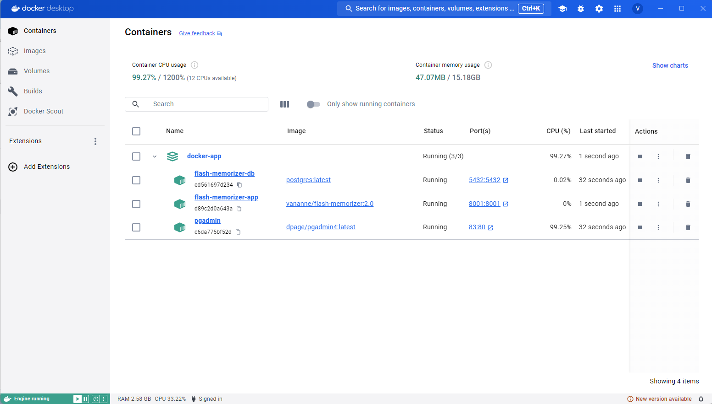

# **Flash memorizer**

_This application provides an immersive learning experience, allowing users to enhance their English language skills effortlessly. Furthermore, It also simplifies the memorization of challenging material, leading to time-saving and enhanced productivity._

### Sections

- [Clone repository](#clone-repository)
- [Access Path (URL)](#access-path-url)
- [Run Database in Docker](#run-database-in-docker)
- [Run the Application in Docker](#run-the-application-in-docker)

## **Clone repository**

```terminal
git clone https://github.com/UniversityWeb/flash-memorizer-it-proj.git
```

## **[Access Path (URL)](http://localhost:8001/)**

- localhost:8001

## **Features**

1. Show Review Cards.
2. Flashcard Repetition Method.
3. Pronunciation Cards.
4. Apply Format Text for Each Card.
5. Auto-generate Multiple-Choice Questions with a Single Answer.

## **Technical**

1. Tools: IntelliJ IDE (Free Edition), Docker, MySQL Workbench.
2. SQL: MySQL.
3. Backend framework: Spring boot.
4. UI: Bootstrap.
5. Concepts: JPA, Spring Security, MVC, SOLID, Design pattern.

## **Run Database in Docker**

Please note: You must be in the `docker-db` folder. The database will be opened on port `3307`.

### To Run

```
docker-compose up -d
```


#### Remove container without deleting MySQL data

```
docker-compose down
```

### Connect Database with MySQL Workbench

- Connection Name: `Docker Provider`
- Hostname: `localhost`
- Port: `3307`
- Username: `root`
- Password: `root`


## **Run The Application in Docker**

Please note: You must be in the `docker-app` folder. The database and the application will be opened on ports `3307` and `8001`, respectively.

### To Run

```
docker-compose up -d
```



#### Remove container without deleting MySQL data

```
docker-compose down
```